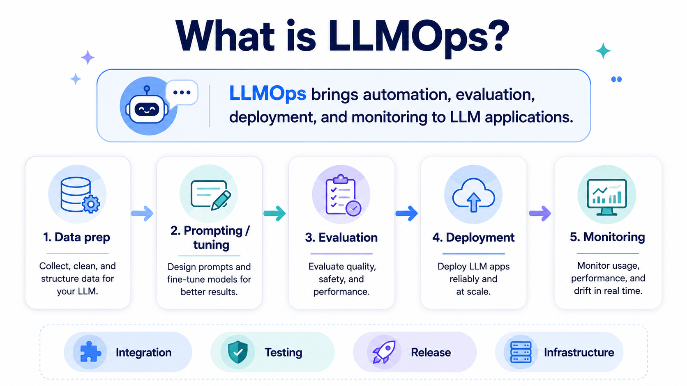
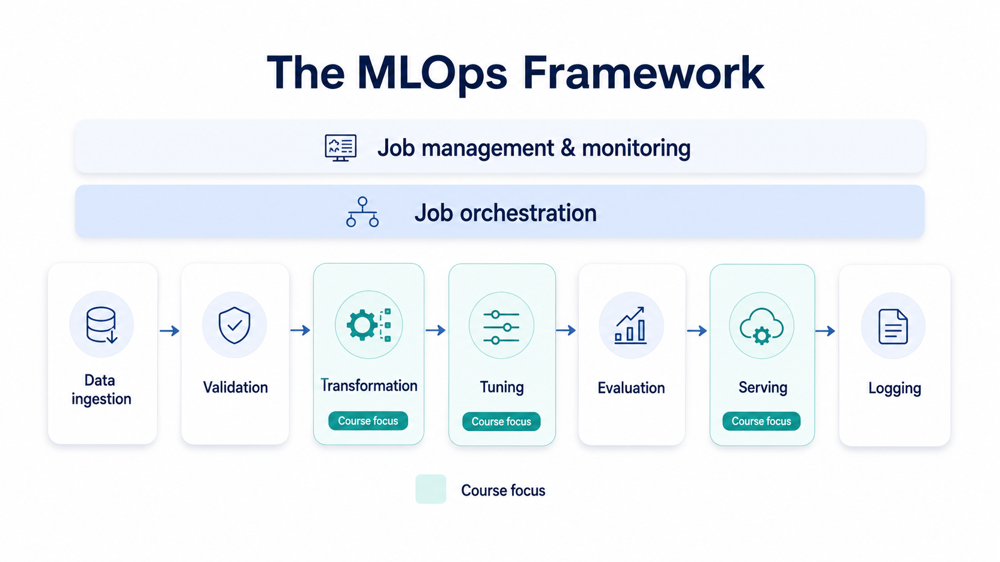
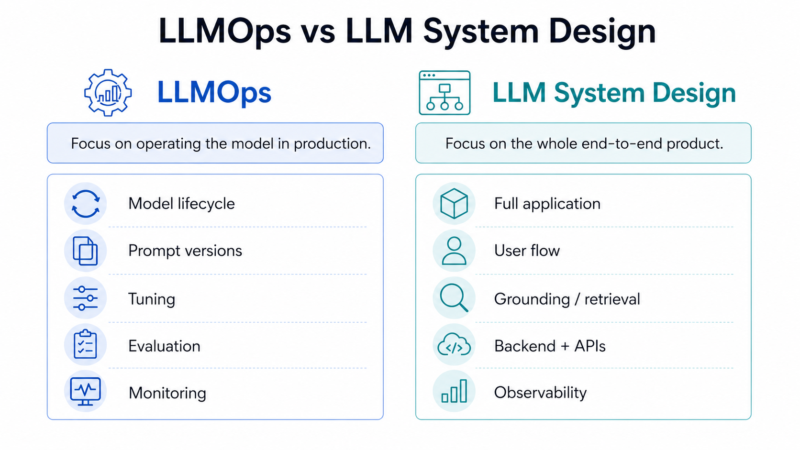
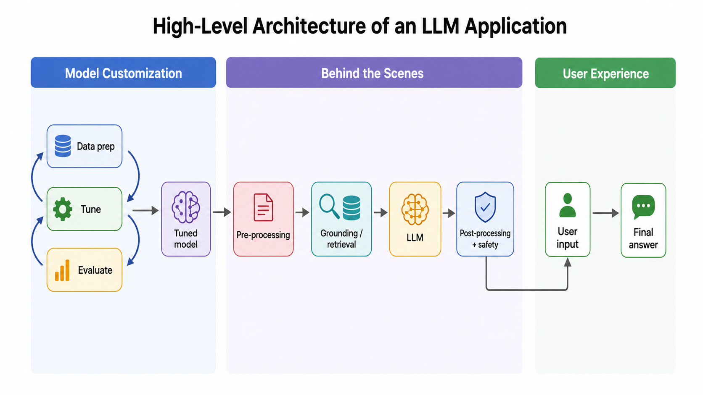
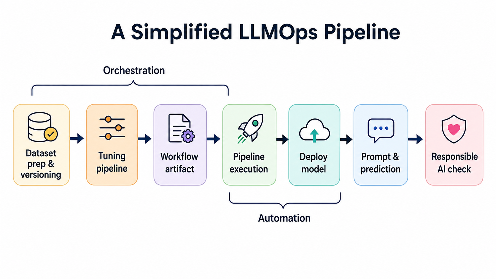
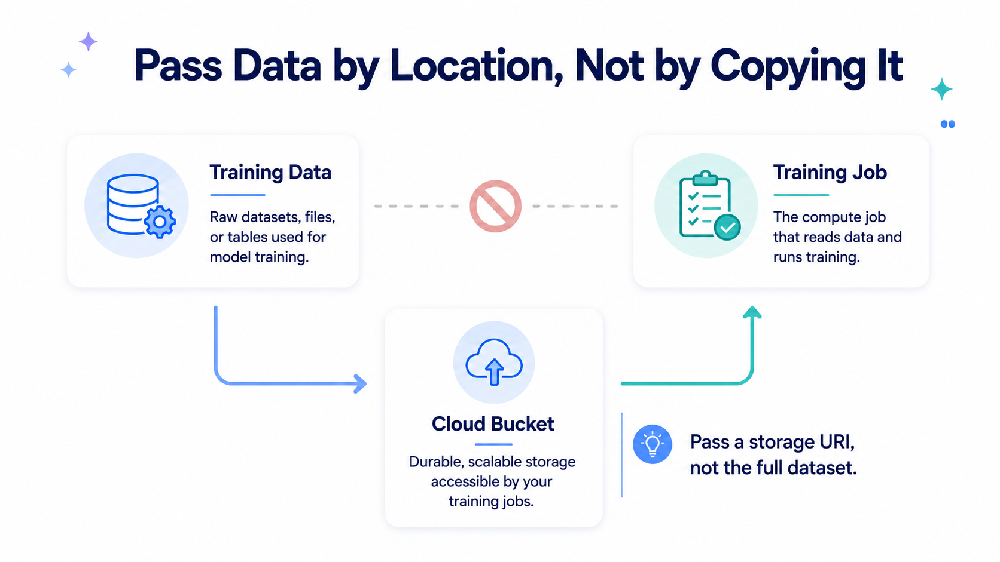
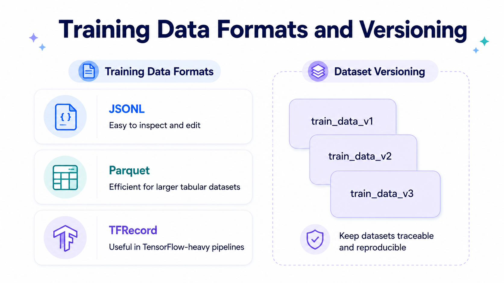
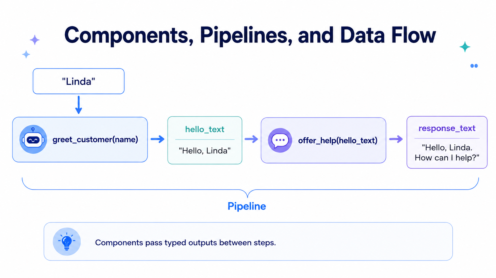
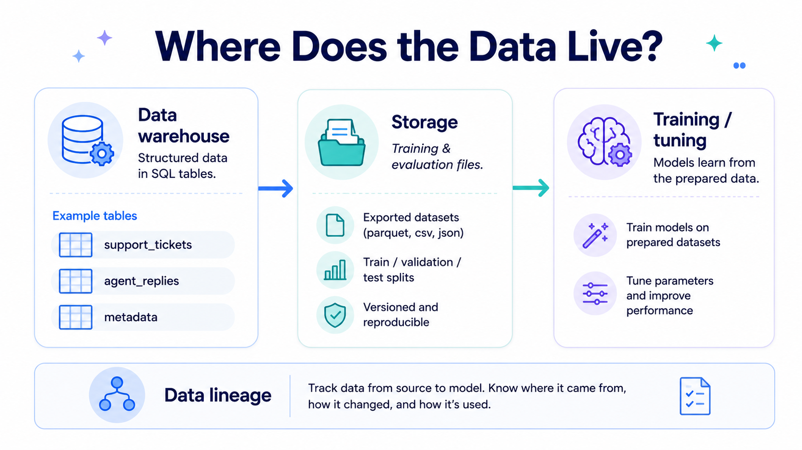
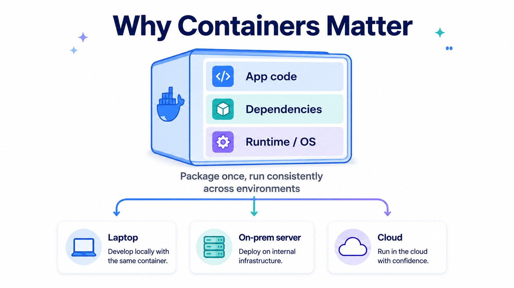

# LLMOps: from prototype to production workflow


> **Course outcome:** by the end, learners understand how an LLM prototype becomes a repeatable production workflow: data preparation, versioning, orchestration, deployment, prompt consistency, evaluation, safety, and monitoring.

---

## What we are exploring

Many beginners first meet LLMs through a prompt box: ask a question, get an answer, improve the prompt, repeat. That is useful for discovery, but it is not enough when the assistant becomes part of a real product.

Imagine a team builds one support assistant that drafts replies to customer tickets. The first version may be built manually: a few example tickets, a prompt, a model endpoint, and some quick testing. Then the team asks for more: classify tickets, route urgent issues, summarize conversations, extract refund reasons, and produce weekly reports. Suddenly the problem is not just “which prompt works?” The problem becomes “how do we safely repeat the whole process without losing track of data, prompts, models, tests, and deployments?”

That is the role of LLMOps.



LLMOps is the operating discipline around LLM applications. It does not replace product design, software engineering, or model research. It connects them into a workflow that can be repeated, tested, monitored, and improved.

> **Core intuition**  
> A prototype proves that an LLM *can* do something. LLMOps helps you prove that the system can keep doing it reliably when data, users, prompts, models, and requirements change.


## 1. MLOps, LLMOps, and LLM system design

Traditional MLOps focuses on the machine learning lifecycle: ingest data, validate it, transform it, train or tune a model, evaluate it, deploy it, and monitor it. LLMOps keeps those ideas but adapts them to LLM applications, where the model may be a foundation model, a hosted API, a fine-tuned model, or a model connected to retrieval and tools.

LLM system design is broader. It asks how the entire application works: user interface, backend, database, retrieval system, authentication, feedback collection, rate limits, and user experience. LLMOps is narrower and more operational: how we manage the LLM-related artifacts and workflow.



| Area | Main question | Example decisions |
|---|---|---|
| **LLMOps** | How do we operate the LLM part reliably? | prompt versions, tuning data, eval sets, model endpoints, rollback, monitoring |
| **LLM system design** | How does the whole product work end to end? | UI, backend, retrieval, auth, memory, user feedback, data privacy |
| **MLOps foundation** | How do we make ML workflows reproducible? | data validation, training pipelines, model registry, deployment automation |

A useful way to connect the concepts is this: LLM system design decides *what* the application is; LLMOps makes the LLM part *repeatable and inspectable*.


## 2. The two loops inside a production LLM application

A user sees a simple flow: they type something, the application answers. Behind that answer, a production LLM application usually has two loops.

The **online loop** handles the actual user request. It may clean or chunk the input, retrieve relevant context, call a model, post-process the response, apply safety checks, and return the final answer.

The **offline improvement loop** uses logs, feedback, examples, and evaluations to improve the system. This is where we prepare datasets, compare prompt templates, tune or adapt models, run evaluations, and decide whether a new version is safe to release.



In the support assistant example, the online loop may take Linda’s customer ticket and draft a helpful reply. The offline loop may later use reviewed tickets to improve the assistant. These two loops should not be confused. The online loop is about serving the user now. The offline loop is about making the next version better.

> **Insight**  
> Many LLM failures are not “model failures” only. They are workflow failures: the wrong prompt template reached production, the evaluation set was too easy, the data changed, the new model was never tested on real examples, or nobody noticed latency had doubled.


## 3. The simplified LLMOps pipeline

A pipeline is the repeatable factory behind the LLM part of the product. It can prepare data, create training and evaluation files, configure a tuning or adaptation job, deploy a model or prompt version, and run checks before release.



This diagram hides a lot of detail, but the logic is simple. We start with data preparation and versioning. Then we define a workflow with parameters. That workflow becomes an artifact, often a YAML file, JSON manifest, or pipeline specification. The artifact is executed by a pipeline engine. If it succeeds, the output can be a model endpoint, a prompt template release, a report, or a deployment candidate.

The key idea is that the pipeline should make experiments comparable. If every run changes the dataset, the prompt, the split, the model, and the thresholds all at once, the team cannot tell what caused the result. LLMOps is partly about discipline: change deliberately, record what changed, and evaluate before release.


## 4. Data preparation: where the work should happen

LLM work often begins with text data: support tickets, chat conversations, product descriptions, search logs, legal clauses, documentation pages, or reviewed answers. Beginners often try to load everything into a notebook. That works for small samples, but it breaks when the dataset becomes large.

A better pattern is to keep large data where it already lives, transform it there, and export only the prepared artifacts needed for training or evaluation.



For a support assistant, the raw data might live in a data warehouse. The warehouse has tables like `tickets`, `agent_replies`, and `ticket_metadata`. SQL is useful here because filtering, joining, and cleaning can happen close to the data instead of pulling millions of rows into memory.

A prepared row for tuning or evaluation usually needs an **input** and an **expected output**. For example:

```json
{
  "input_text": "Customer issue: My delivery arrived damaged. Draft a calm support reply.",
  "output_text": "I’m sorry your delivery arrived damaged. Please share a photo of the item and packaging, and I’ll help start a replacement or refund request."
}
```

For instruction-tuned systems, the input should include the task instruction. Without the instruction, the example may look like just another piece of text. With the instruction, the model sees the role it should perform.

```text
You are a support assistant. Draft a concise, polite reply that explains the next step.

Customer ticket:
{{customer_message}}
```

This instruction is not just wording. It is part of the data contract. If the model was tuned or evaluated with this structure, production should use the same structure unless you are intentionally testing a new one.


## 5. File formats and versioning

Once data has been selected and transformed, it is usually exported into training and evaluation artifacts. For beginner projects, JSONL is often the easiest format because each line is one JSON object and it is easy to inspect. For larger datasets, Parquet or framework-specific formats can be more efficient.



| Format | Good beginner use | When to reconsider |
|---|---|---|
| **JSONL** | You want readable rows for instruction/input/output examples. | The dataset becomes very large or read speed becomes a bottleneck. |
| **Parquet** | You have large tabular data and want efficient storage and filtering. | Your training framework expects row-oriented JSON examples. |
| **TFRecord** | You are deep in TensorFlow-oriented training pipelines. | Your team needs simple inspection and broad ecosystem compatibility. |

The second important habit is versioning. Versioning is not only for models. It applies to datasets, prompts, evaluation sets, configuration files, pipeline specs, and deployment manifests.



A useful artifact name is descriptive. A useful manifest is even better. For example, `support_reply_train_2026-06-09.jsonl` tells you roughly what the file is. A manifest tells you where it came from, which query produced it, what split seed was used, what prompt template was attached, and which evaluation set should be used with it.

> **Practical rule**  
> If you cannot explain which data, prompt template, model, and evaluation set produced a result, you cannot safely compare that result with another one.


## 6. Orchestration versus automation

Two words appear constantly in LLMOps: orchestration and automation. They are related, but they are not the same.

**Orchestration** defines the order and dependencies of steps. Data preparation must run before tuning. Tuning must run before deployment. Evaluation may run during tuning and again before release.

**Automation** runs those steps without a person manually copy-pasting commands from one notebook cell to another.



A beginner pipeline can start with two normal Python functions. One function creates a greeting for Linda. The second function takes the greeting and adds support context. In a real workflow, replace those toy components with steps like `prepare_dataset`, `validate_jsonl`, `run_evaluation`, and `register_release_candidate`.

The important idea is the dependency graph. The second step should receive the output of the first step, not rely on hidden notebook state.

```python
def greet_customer(name: str) -> str:
    return f"Hello {name},"


def add_support_context(greeting_text: str, issue: str) -> str:
    return f"{greeting_text} I can help with your issue: {issue}"


greeting = greet_customer(name="Linda")
final_prompt = add_support_context(
    greeting_text=greeting,
    issue="the package arrived damaged"
)
```

In real pipeline frameworks, the objects can look more complex. A component may return a task object, an output reference, or a file URI. For large data, the best practice is often not to pass the actual dataset between steps. Pass the location.



This one pattern prevents many scaling problems. Instead of sending a huge dataframe through the pipeline graph, write the data to object storage and pass `s3://...`, `gs://...`, or another URI to the next component.


## 7. Containers: why your pipeline step runs elsewhere

When a pipeline runs in production, it may not run on your laptop. One component may run in CI, another on a cloud worker, another on a GPU machine. This is why containers matter.



A container packages the code, dependencies, and runtime needed by a step. This does not magically solve all environment problems, but it makes the environment explicit. The same component can be executed more consistently across machines.

For beginners, the key point is not to memorize Docker commands immediately. The key point is to understand why pipeline tools often ask for an image, package, component spec, or environment definition. They need to know how to run your code somewhere else.


## 8. Which orchestration tool should you think about?

There is no universal winner. The right tool depends on what you are orchestrating.

| Tool family | Good fit | Beginner mental model |
|---|---|---|
| **Airflow-style DAGs** | Scheduled data workflows, recurring jobs, dependencies between tasks. | “Run these tasks in this order, every day or when triggered.” |
| **Kubeflow Pipelines-style ML pipelines** | ML workflows with components, artifacts, training/evaluation jobs, and cloud execution. | “Package each ML step as a component and compile the workflow.” |
| **LangGraph-style LLM graphs** | Stateful agent or multi-step LLM application logic. | “Control how an LLM app moves between states, tools, and human review.” |
| **Plain Python scripts** | Small beginner projects and local learning. | “Make the concept clear before adding infrastructure.” |


## 9. Deployment: batch, API, and prompt contracts

Deployment means making the LLM capability usable by another system. Sometimes that means batch prediction: once per day or week, process a set of documents or tickets. Sometimes it means an API: the user asks something and expects a response quickly.

| Deployment style | Best when | Example |
|---|---|---|
| **Batch** | The result does not need to be immediate. | Summarize yesterday’s support tickets every morning. |
| **REST/API endpoint** | The product needs an answer during the user flow. | Draft a reply while a support agent is viewing a ticket. |

The most common beginner mistake is to treat deployment as only “call the model.” Production code also has to preserve the prompt contract.

If evaluation used this structure:

```text
You are a support assistant. Draft a concise, polite reply that explains the next step.

Customer ticket:
{{customer_message}}
```

then production should not casually send only:

```text
My delivery arrived damaged.
```

That mismatch can reduce quality because the production input no longer matches the examples used during evaluation or tuning.

> **Insight**  
> Prompt templates are production artifacts. They deserve names, versions, tests, and rollback plans just like code.


## 10. Safety, evaluation, and monitoring

Once the model is deployed, the work is not over. LLM applications need monitoring because the environment around them changes: users ask new things, costs shift, latency changes, providers update models, documents become stale, and prompt templates evolve.

A practical monitoring setup usually combines several signal types.

| Signal | What it tells you | Example metric |
|---|---|---|
| **Operational** | Is the system technically healthy? | latency, errors, throughput |
| **Cost** | Is the system financially sustainable? | tokens per request, cache hit rate, daily spend |
| **Quality** | Is the output useful? | eval score, user rating, review pass rate |
| **Safety** | Is the output within policy? | blocked rate, review queue rate, policy flags |

Evaluation should not be a one-time notebook cell. It should become a gate. Before a new prompt template or model version reaches production, it should pass a small but meaningful evaluation set that reflects the actual use case.

A beginner-friendly evaluation can start simple:

```python
def score_reply(reply: str) -> dict:
    return {
        "has_next_step": any(word in reply.lower() for word in ["please", "share", "send", "confirm"]),
        "too_short": len(reply.split()) < 12,
        "mentions_policy": "refund" in reply.lower() or "replacement" in reply.lower(),
    }
```

This is not a perfect evaluation. It is a starting point. The deeper lesson is that evaluation has to be explicit. If the team cannot say what “good” means, the pipeline cannot protect quality.


## 11. Hands-on practice

This course includes three small notebooks. 

| Notebook | What students practice | Why it matters |
|---|---|---|
| `01_data_prep_versioning.ipynb` | Build a small support-ticket dataset, add an instruction, split train/eval, export JSONL, create a manifest. | Shows that data and prompt structure are artifacts. |
| `02_pipeline_orchestration.ipynb` | Turn steps into a tiny pipeline and pass file locations between steps. | Shows orchestration without hiding behind infrastructure. |
| `03_prompt_contract_safety_monitoring.ipynb` | Compare prompt versions, simulate responses, log safety/quality telemetry. | Shows why production prompts, evals, and monitoring belong together. |


## 12. Summary

LLMOps is what turns LLM development from a collection of clever experiments into a controlled system. The important shift is not “use a bigger framework.” The important shift is to treat data, prompts, models, evaluation sets, configuration, and monitoring rules as artifacts that can be versioned and connected.

In this course, here's what you should remember:

| Concept | What to remember |
|---|---|
| LLMOps | The repeatable operating loop around LLM applications. |
| Data preparation | Transform near the data; export prepared artifacts. |
| Prompt contract | Production inputs should match evaluated/tuned inputs. |
| Versioning | Track datasets, prompts, models, manifests, and eval sets. |
| Orchestration | Define step order and dependencies. |
| Automation | Run the workflow without manual notebook execution. |
| Deployment | Serve the LLM capability through batch or API. |
| Monitoring | Watch quality, safety, cost, and operations after release. |

The next step is to open the notebooks and build the mini workflow yourself.

